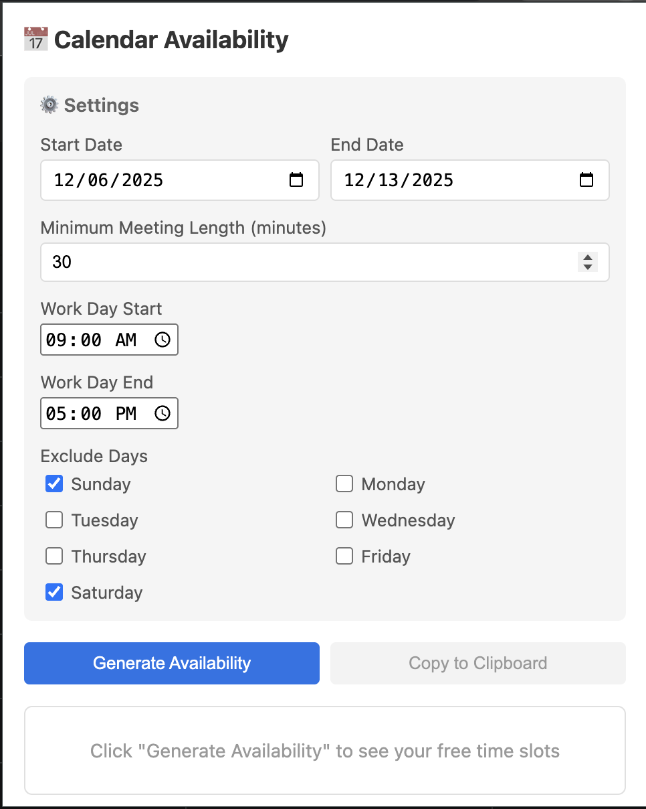
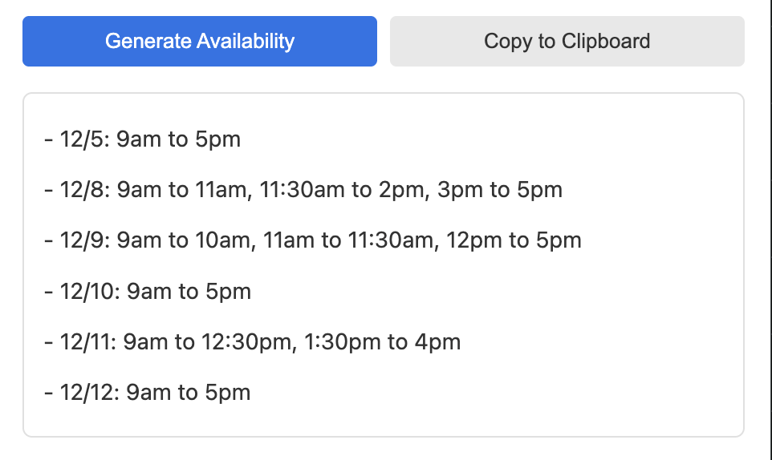

# Calendar Availability Chrome Extension

A simple Chrome extension that generates formatted calendar availability from Google Calendar by reading directly from the calendar page - **no OAuth setup required!**








## Features

- 📅 **Direct Calendar Access** - Works directly on calendar.google.com (no API setup needed!)
- ⚙️ **Customizable Settings**:
  - Set date range for availability
  - Configure work hours (start/end times)
  - Exclude specific days of the week (weekends excluded by default)
  - Set minimum meeting length (filters out slots shorter than specified time)
- 📋 **Easy Copy** - One-click copy to clipboard
- 💾 **Persistent Settings** - Your preferences are saved automatically
- 🔒 **Privacy First** - Reads directly from page, no data sent anywhere

## Output Format

```
- 3/1: 9:00am to 5:00pm
- 3/2: 9:00am to 2:30pm, 4:40pm to 5:00pm
```

## Installation

```bash
# Build the extension
npm install
npm run build

# Load in Chrome:
# 1. Open chrome://extensions/
# 2. Enable "Developer mode"
# 3. Click "Load unpacked"
# 4. Select the 'dist' folder
```

## Usage

1. Open Google Calendar (calendar.google.com)
2. Click the extension icon
3. Configure settings & click "Generate Availability"
4. Copy to clipboard

**That's it! No OAuth, no API keys, no setup!**

## How It Works

Reads calendar events directly from the Google Calendar webpage using a content script. No external API calls or authentication needed.

## Development

```bash
npm run dev     # Development mode with watch
npm run build   # Production build
npm run clean   # Clean dist folder
```

## Troubleshooting

- **"Please open Google Calendar"** - Extension only works on calendar.google.com
- **No events detected** - Try Week or Day view, refresh the page
- **No availability** - Check date range and settings

## Privacy

- ✅ Only accesses calendar.google.com
- ✅ Reads from page, no external requests
- ✅ No data transmitted anywhere
- ✅ Settings stored locally only

## License

MIT


# Quick Setup Guide

## Step-by-Step Installation

### 1. Install Dependencies
```bash
npm install
```

### 2. Initial Build
```bash
npm run build
```

### 3. Load in Chrome (First Time)
1. Open `chrome://extensions/`
2. Enable "Developer mode"
3. Click "Load unpacked"
4. Select the `dist` folder
5. **IMPORTANT**: Copy the Extension ID shown

### 4. Rebuild & Reload
```bash
npm run build
```

Then in Chrome:
- Go to `chrome://extensions/`
- Click reload icon on your extension

### 5. Test
1. Click the extension icon
2. Generate availability!

## Common Issues

### No availability showing
- Check date range
- Verify work hours
- Check excluded days
- Ensure you have calendar events

## Development Commands

```bash
# Watch mode for development
npm run dev

# Production build
npm run build

# Clean build folder
npm run clean
```

## Need Help?

1. Check README.md for full documentation
2. Verify all steps above are complete
3. Check Chrome DevTools console for errors (right-click extension > Inspect popup)

